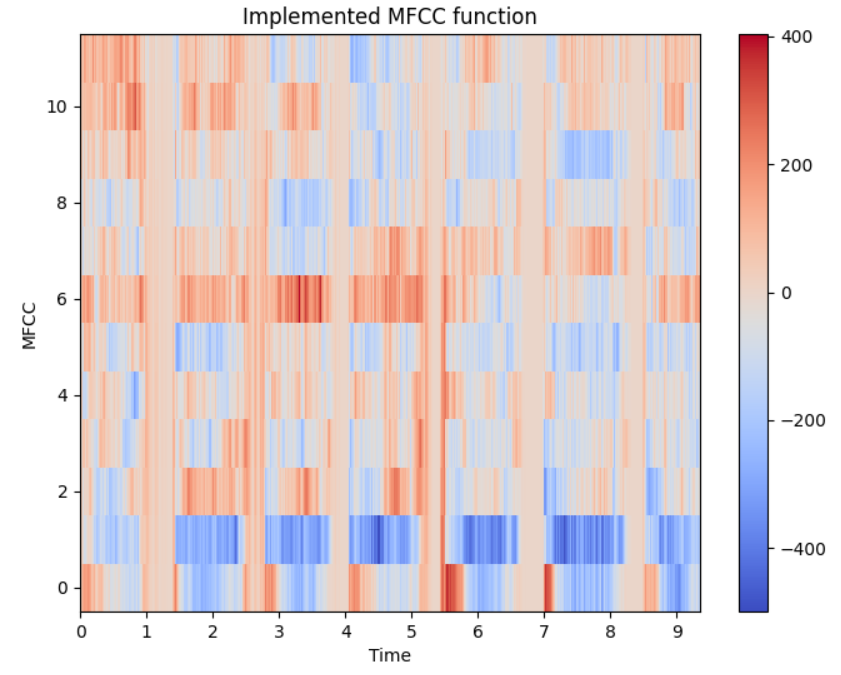

# AI Arabic Keyword Detection Model 🎙️🧠

<div align="center">

A deep learning-based Arabic speech keyword detection system using CNN and MFCC features to classify spoken commands.

<br>

<div align="center">
  
</div>

<br>

<div align="center">
  <a href="https://codeload.github.com/TendoPain18/ai-arabic-keyword-detection-model/legacy.zip/main">
    
  </a>
</div>

</div>

## 📋 Description

This project implements a complete pipeline for Arabic spoken keyword detection using deep learning. It covers everything from smart dataset collection to training a lightweight CNN classifier — designed to run efficiently on embedded or real-time systems.

The key insight behind this project is using **Whisper only for data collection**, not inference. Whisper is a powerful but heavy model — too heavy for real-time keyword detection. Instead, it was used once to precisely extract target keywords from raw audio, building a clean labeled dataset. A lightweight CNN was then trained on that dataset to handle inference efficiently.

### Data Collection Strategy

I collected Arabic audio samples from YouTube videos by searching captions for sentences containing the target keywords. I downloaded the matching video segments and fed them into OpenAI's Whisper model, which precisely extracted the exact keyword pronunciations from short audio clips. This gave me a high-quality labeled dataset without any manual audio labeling.

```
YouTube Caption Search (keyword query)
        │
        ▼
Download matching video segments
        │
        ▼
Whisper model → extract exact keyword audio
        │
        ▼
Clean labeled .wav dataset
        │
        ▼
Train lightweight CNN (this repo)
```

## 🎯 Project Objectives

1. **Collect & organize audio data** from a structured dataset of spoken commands
2. **Extract MFCC features** from raw `.wav` files for model input
3. **Train a CNN classifier** to recognize keywords vs. unknown/background audio
4. **Evaluate model accuracy** and analyze per-word prediction errors
5. **Visualize training performance** with accuracy and loss curves

## ✨ Features

- **Modular Pipeline**: Separate classes for data collection, preprocessing, and model training
- **MFCC Feature Extraction**: 16-coefficient MFCCs computed with windowed analysis
- **CNN Architecture**: Multi-layer Conv2D network with dropout regularization
- **Keyword Mapping**: Flexible target keyword selection from any folder in the dataset
- **Error Analysis**: Per-class false positive and false negative tracking
- **Training Visualization**: Accuracy and loss plots across epochs

## 🔬 System Overview

### Pipeline Stages

```
Raw Audio (.wav)
      │
      ▼
┌─────────────────┐
│  DataCollect    │  ← Scans dataset folders, shuffles filenames
└────────┬────────┘
         │
         ▼
┌─────────────────┐
│  DataProcess    │  ← Computes MFCCs, splits into train/val/test sets
└────────┬────────┘
         │
         ▼
┌─────────────────┐
│  ModelTrain     │  ← Builds CNN, trains on features, saves .h5 model
└────────┬────────┘
         │
         ▼
   Saved Model (.h5)
```

### MFCC Configuration

| Parameter | Value |
|-----------|-------|
| Sample Rate | 8000 Hz |
| Number of Coefficients | 16 |
| MFCC Length | 16 frames |
| Window Length | 256 ms |
| Window Step | 50 ms |
| FFT Size | 2048 |

### CNN Architecture

```
Input: (16, 16, 1) MFCC feature map
  → Conv2D (32 filters, 2×2) + ReLU + MaxPooling
  → Conv2D (32 filters, 2×2) + ReLU + MaxPooling
  → Conv2D (64 filters, 2×2) + ReLU + MaxPooling
  → Flatten
  → Dense (64) + ReLU + Dropout (0.5)
  → Dense (8) + Softmax
Output: 8-class prediction (7 keywords + "nothing")
```

## 🚀 Getting Started

### Prerequisites

```
Python 3.7+
TensorFlow / Keras
librosa
python_speech_features
numpy
matplotlib
```

Install dependencies:
```bash
pip install tensorflow librosa python_speech_features numpy matplotlib playsound
```

### Dataset

The project uses a structured audio dataset where each subfolder contains `.wav` samples for one spoken word. The [Google Speech Commands Dataset](https://www.tensorflow.org/datasets/catalog/speech_commands) is a compatible source.

```
dataset/
├── one/
│   ├── sample_0.wav
│   └── ...
├── two/
├── three/
├── on/
├── off/
├── _background_noise_/   ← automatically excluded
└── ...
```

### Usage

**1. Full Training Pipeline**
```python
# main.py
dc = DataCollect(path)
dc.remove_folder_name('_background_noise_')
filenames, y = dc.get_samples()

pr = DataProcess(path, dc.get_folders_names_list(), filenames, y)
pr.divide_data_to_train_val_test(1, 0.1, 0.1)
pr.clean_data()
pr.save_data('all_targets_mfcc_sets.npz')

mt = ModelTrain(path, dc.get_folders_names_list())
mt.load_data_file('all_targets_mfcc_sets.npz')
mt.mark_key_words(['one', 'two', 'three', 'four', 'five', 'on', 'off'])
mt.create_model()
mt.fit_data()
mt.save_model('wake_word_stop_model.h5')
```

**2. Evaluate a Saved Model**
```bash
python test_the_model.py
```

**3. Visualize MFCC of a Sample**
```python
pr.test_audio(idx=0)   # plays audio and shows MFCC heatmap
```

## 🤝 Contributing

Contributions are welcome! Feel free to improve the model architecture, add real-time microphone inference, or extend the keyword set.

<br>
<div align="center">
  <a href="https://codeload.github.com/TendoPain18/ai-arabic-keyword-detection-model/legacy.zip/main">
    
  </a>
</div>

## <!-- CONTACT -->
<div id="toc" align="center">
  <ul style="list-style: none">
    <summary>
      <h2 align="center">
        🚀
        CONTACT ME
        🚀
      </h2>
    </summary>
  </ul>
</div>
<table align="center" style="width: 100%; max-width: 600px;">
<tr>
  <td style="width: 20%; text-align: center;">
    <a href="https://www.linkedin.com/in/amr-ashraf-86457134a/" target="_blank">
      
    </a>
  </td>
  <td style="width: 20%; text-align: center;">
    <a href="https://github.com/TendoPain18" target="_blank">
      
    </a>
  </td>
  <td style="width: 20%; text-align: center;">
    <a href="mailto:amrgadalla01@gmail.com">
      
    </a>
  </td>
  <td style="width: 20%; text-align: center;">
    <a href="https://www.facebook.com/amr.ashraf.7311/" target="_blank">
      
    </a>
  </td>
  <td style="width: 20%; text-align: center;">
    <a href="https://wa.me/201019702121" target="_blank">
      
    </a>
  </td>
</tr>
</table>
<!-- END CONTACT -->
